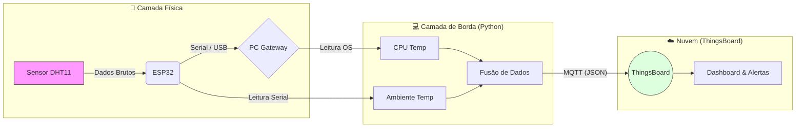

# 🌡️ CoreSense: Monitoramento Térmico Híbrido (IoT)


> **Resumo:** Sistema de telemetria Full-Stack que correlaciona temperatura de processamento (CPU) e ambiental (Sala) para manutenção preditiva em Data Centers.

---

## 📸 Visão Geral do Projeto

O **CoreSense** resolve o problema da "cegueira de diagnóstico". Ele cruza dados de sensores físicos e lógicos para determinar, via **Diferencial Térmico (Delta T)**, se um superaquecimento é causado por falha no hardware interno (cooler parado) ou por falha ambiental (ar-condicionado desligado).

### 🖥️ Dashboard (ThingsBoard)

*(Interface Dark Mode com indicadores Neon para fácil leitura em NOCs)*

---

## 🔄 Arquitetura do Sistema

O sistema utiliza uma abordagem de **Edge Computing**. O script Python atua como Gateway, fundindo dados do Hardware (Serial) com dados do Kernel (OS) antes de enviar para a nuvem.



### ✨ Principais Funcionalidades
* **Monitoramento Híbrido:** Leitura simultânea do sensor DHT11/22 (Ambiente) e psutil (CPU).
* **Conexão Serial Robusta:** Elimina a instabilidade do Wi-Fi no microcontrolador, usando conexão USB robusta para dados e energia.
* **Feedback Físico Reativo:** O ESP32 utiliza o **LED Integrado (GPIO 2)** para piscar fisicamente caso a CPU do PC ultrapasse o limite crítico de **80°C.**
* **Análise de Tendência:** Gráfico de séries temporais para correlação de falhas.

---

## 🛠️ Hardware e Pinagem

### Lista de Componentes
* Microcontrolador **ESP32 DevKit V1**
* Sensor de Temperatura/Umidade **DHT11** ou **DHT22** 
* Cabo Micro-USB de dados
* (Opcional) LED Externo + Resistor 220Ω

### Esquema de Ligação (Wiring)

| Componente | Pino do Componente | Pino do ESP32 | Função |
| :--- | :--- | :--- | :--- |
| **DHT22** | VCC | 3V3 / VIN | Alimentação |
| **DHT22** | DATA | **GPIO 4** | Leitura de Dados |
| **DHT22** | GND | GND | Terra |
| **LED** | Anodo (+) | **GPIO 13** | Sinal de Alerta |
| **LED** | Catodo (-) | GND | Terra (via Resistor) |

---

## 📂 Estrutura do Projeto

```text
/CoreSense_Final
│
├── /Hardware      # Código C++ do Microcontrolador
│   └── esp32-port.ino         # Lógica de leitura e controle do LED via Serial
│
├── /Software      # Agente rodando no PC (Host)
│   ├── gateway_final.py  # Script principal (Serial <-> MQTT)
│   └── requirements.txt # Dependências (pyserial, paho-mqtt, psutil)
│
└── README.md            # Documentação do projeto
````
----
## 🚀 Instalação e Execução
## 1. Preparação do Hardware (ESP32)

* Instale a **Arduino IDE**.
* Instale a biblioteca DHT sensor library (por Adafruit).
* Carregue o código da pasta /Hardware para a placa.

          Nota: Não é necessário configurar Wi-Fi no código do ESP32.

## 2.Gateway (Python)
Certifique-se de ter o Python 3.8+ instalado.

```bash
cd Software
pip install -r requirements.txt
```
## 3. Configuração (ThingsBoard)
   1. Crie um dispositivo no ThingsBoard Cloud
   2. Copie o Access Token.
   3. Edite o arquivo gateway.py:

```python
THINGSBOARD_HOST = "thingsboard.cloud"
ACCESS_TOKEN = "SEU_TOKEN_AQUI"  # <--- Cole seu token
SERIAL_PORT = "COM3"             # <--- Verifique no Gerenciador de Dispositivos
```
## 4. Rodando o Projeto

Com o ESP32 conectado à USB, execute:

```
python gateway.py
```
Output esperado: ```[ENVIADO] CPU: 45.0°C | Amb: 24.5°C | LED: NORMAL```
    
## 📊 Visualização

O Dashboard no ThingsBoard foi configurado com:

    Gráfico TimeSeries: Eixo esquerdo (Temp °C) e Eixo direito (Umidade %).

    Neon Gauges: Indicadores visuais de alto contraste para ambientes escuros (NOCs).

## 👨‍💻 Autores
* Gabriel Santos - Engenharia da Computação (UFPA)
* Emanoel Monteiro - Engenharia da Computação (UFPA)
